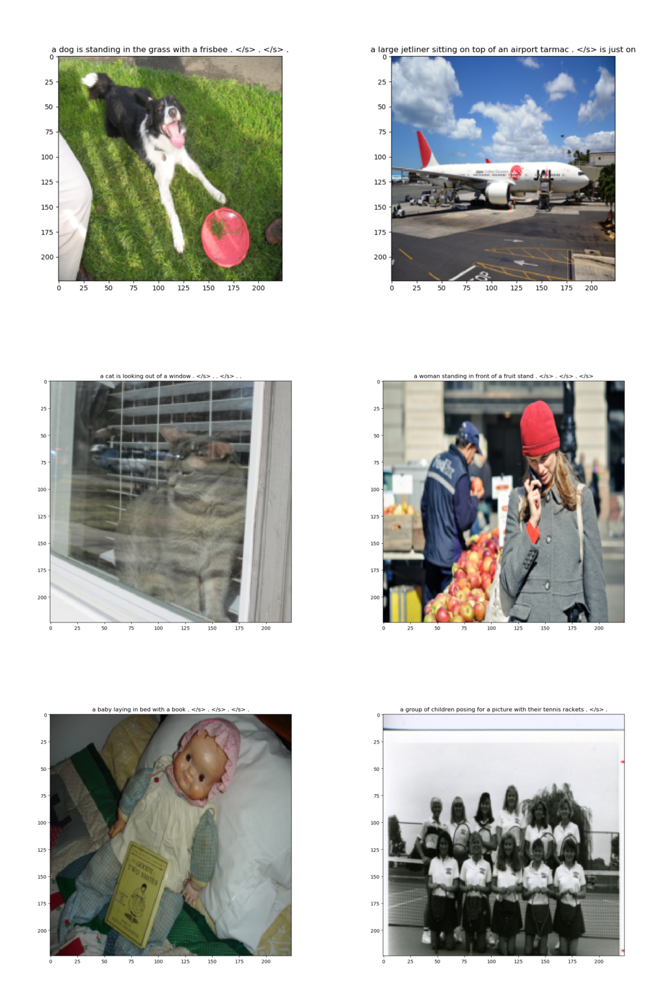
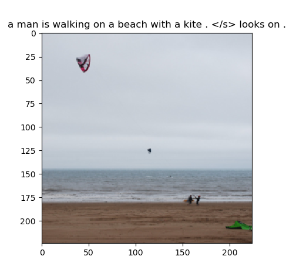
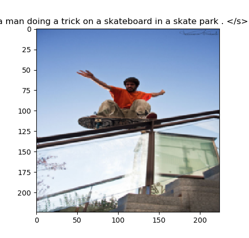
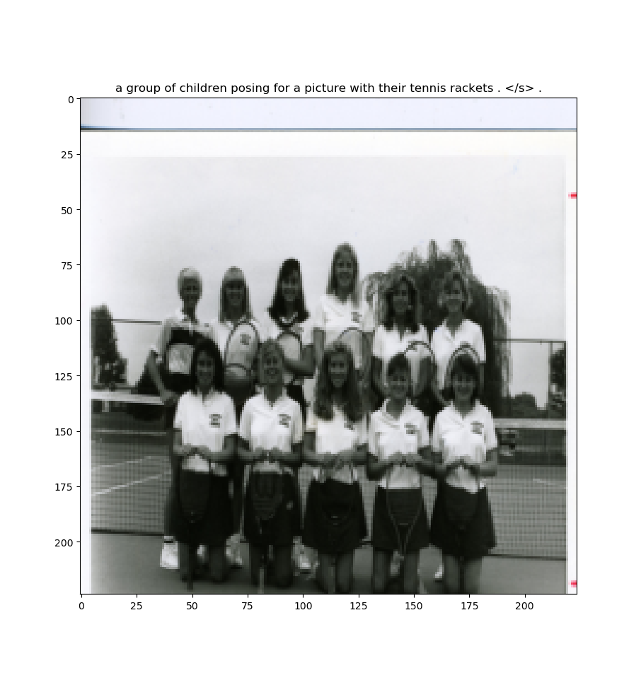
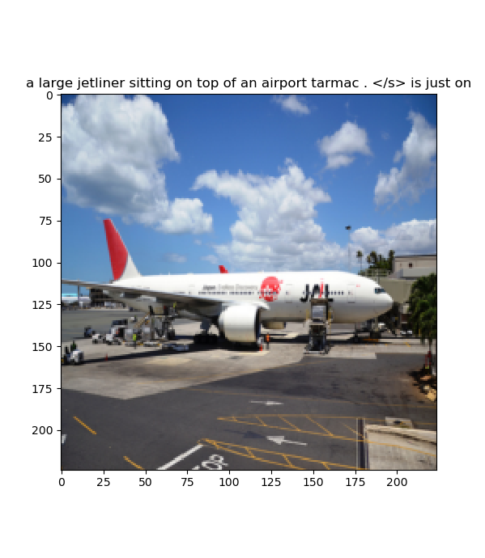

# (WIP) CNN-CNN Image captioning

Image captioning done entirely with CNNs, implemented in Pytorch and based on the paper [CNN+CNN: Convolutional Decoders for Image Captioning](https://arxiv.org/abs/1805.09019),
written by Qingzhong Wang and Antoni B. Chan.

The model was trained using the COCO dataset, using the splitting between training and validation as
provided by the authors.

## Samples



<!--### Simple model-->

<!---->
<!---->

<!--### Hierarchical attention model-->

<!---->
<!---->
<!---->

<!--## Instructions-->

Edit the makefile and change image and caption folders to your dataset path. Also you can specify
different learning rates and batch size.

To train the simple model, run 
```bash
	make train_cnn_cnn_ce
```
To train the hierarchical attention model, run
```bash
	make train_cnn_cnn_ha_ce
```
Model weights will be saved to weigths/cnn_cnn_<ha>_ce_<vocab_size>_<embedding_dim>_<language_layers>.dat

TODO: 
inference script

## Dependencies

 * [Pytorch (> 1.1)](https://github.com/pytorch/pytorch): deep learning framework
 * [Torchvision > 0.3](https://github.com/pytorch/vision/tree/master/torchvision)
 * [pyspellchecker](https://pypi.org/project/pyspellchecker/): to correct the spelling of words in
     captions, used to generate a dictionary with good words.
 * Matplotlib
 * PIL
 * Numpy

## Motivation

This project was done as the final project of the subject Computer Vision at the Robotics
Engineering degree at Alicante's University.
